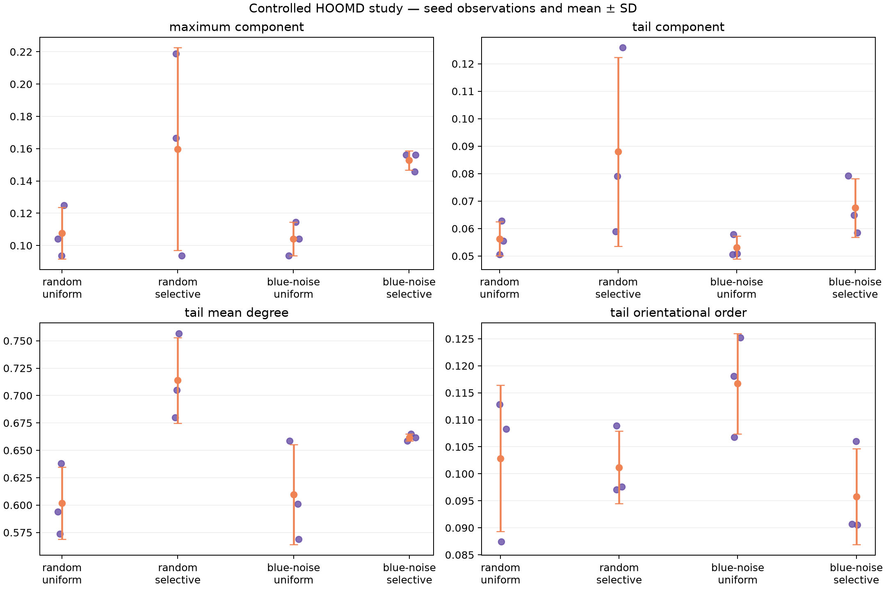
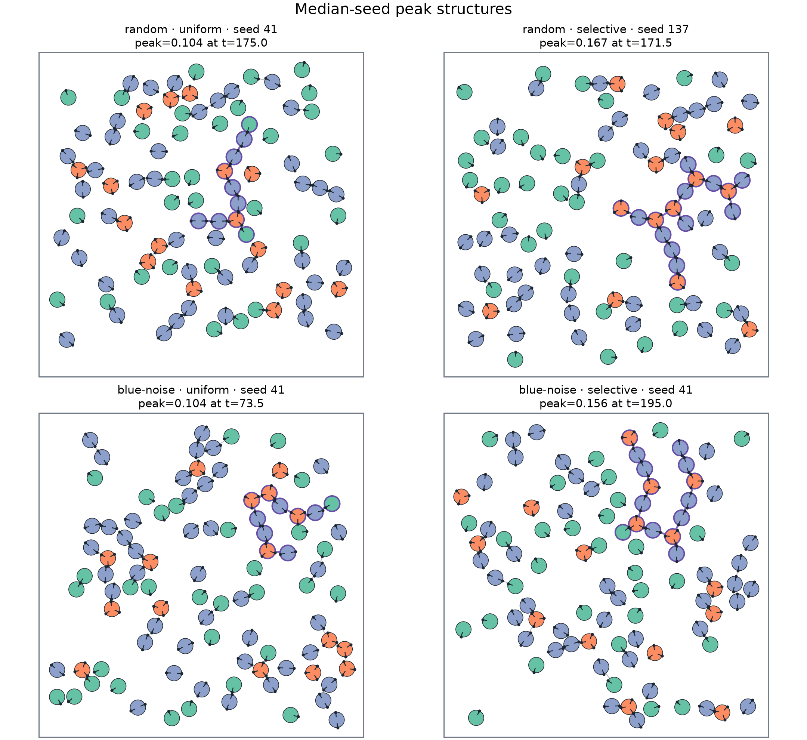
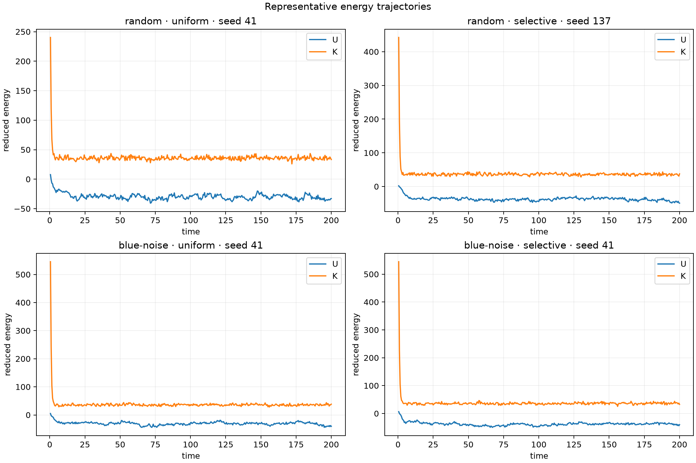

# Experimental Laboratory

The executable companion is available in the same TLF node as an `ipynb`
resource. It loads a controlled HOOMD-blue ensemble consisting of four
conditions and three seeds per condition.

The notebook follows the same semantic sequence as the Lecture:

$$
\text{local model}
\longrightarrow
\text{controlled trajectories}
\longrightarrow
\text{contact graphs}
\longrightarrow
\text{ensemble evidence}.
$$

## Aggregate structural result

The mean maximum connected fractions were:

| Initialization | Type affinity | Mean peak $S_{\max}$ | SD | Mean tail $S_{\max}$ |
|---|---|---:|---:|---:|
| random | uniform | $0.108$ | $0.016$ | $0.056$ |
| random | selective | $0.160$ | $0.063$ | $0.088$ |
| blue noise | uniform | $0.104$ | $0.010$ | $0.053$ |
| blue noise | selective | $0.153$ | $0.006$ | $0.068$ |

Uniform attraction produced nearly equal mean peaks for both initialization
methods. Selective type affinity increased the mean peak under both methods.
The random/selective condition contained the highest individual run but also
the largest seed variance. Blue-noise/selective produced a similar mean with a
much smaller sample standard deviation.

## Individual seeded runs

The summaries above come from the following twelve declared runs. Keeping the
seed-level values visible prevents a condition mean from hiding the variance
that produced it.

| Initialization | Affinity | Seed | Peak $S_{\max}$ | Peak time | Tail $S_{\max}$ | Tail mean degree |
|---|---|---:|---:|---:|---:|---:|
| random | uniform | 41 | $0.104$ | $175.0$ | $0.063$ | $0.638$ |
| random | uniform | 137 | $0.125$ | $31.0$ | $0.056$ | $0.574$ |
| random | uniform | 251 | $0.094$ | $87.5$ | $0.051$ | $0.594$ |
| random | selective | 41 | $0.219$ | $164.0$ | $0.126$ | $0.757$ |
| random | selective | 137 | $0.167$ | $171.5$ | $0.079$ | $0.705$ |
| random | selective | 251 | $0.094$ | $79.5$ | $0.059$ | $0.680$ |
| blue noise | uniform | 41 | $0.104$ | $73.5$ | $0.058$ | $0.659$ |
| blue noise | uniform | 137 | $0.094$ | $132.5$ | $0.051$ | $0.569$ |
| blue noise | uniform | 251 | $0.115$ | $84.5$ | $0.051$ | $0.601$ |
| blue noise | selective | 41 | $0.156$ | $195.0$ | $0.065$ | $0.665$ |
| blue noise | selective | 137 | $0.156$ | $56.5$ | $0.058$ | $0.659$ |
| blue noise | selective | 251 | $0.146$ | $90.5$ | $0.079$ | $0.662$ |

## Representative structures

Each panel uses the seed whose run maximum is the median of its condition. The
frame is that run's maximum connected fraction. Purple edges and outlines mark
the largest inferred contact component. The selection rule is fixed before
visual inspection and avoids presenting only the most dramatic seed.

The snapshots show finite chains and branches rather than one system-spanning
aggregate. This matches the numerical result: the median representative peaks
contain about $10\%$ to $17\%$ of the $96$ particles.

The largest individual event occurred in the random/selective condition, where
$S_{\max}=0.21875$: $21$ of $96$ particles belonged to one inferred component.
That event is visible as an individual seed observation, but it is not used as
the representative panel because the figure selects the median seed.

## Energy and thermostat

All four conditions remained close to the target kinetic temperature $0.25$
over the final quarter of saved frames. Selective conditions had more negative
mean tail potential energy than uniform conditions, consistent with their
stronger favored contacts. Because the thermostat exchanges energy with the
system, this plot is context for assembly rather than an energy-conservation
test.

## Reproduction

From `storage/projects/code/local/patchy-particle-emergence/hoomd/`:

~~~bash
pixi run test
pixi run study
pixi run notebook-build
pixi run notebook-execute
pixi run notebook-publish
~~~

Generated trajectories and raw tables remain ignored local outputs. The
published notebook embeds the evaluated tables and figures, while every local
run retains its resolved TOML input and checksum.
